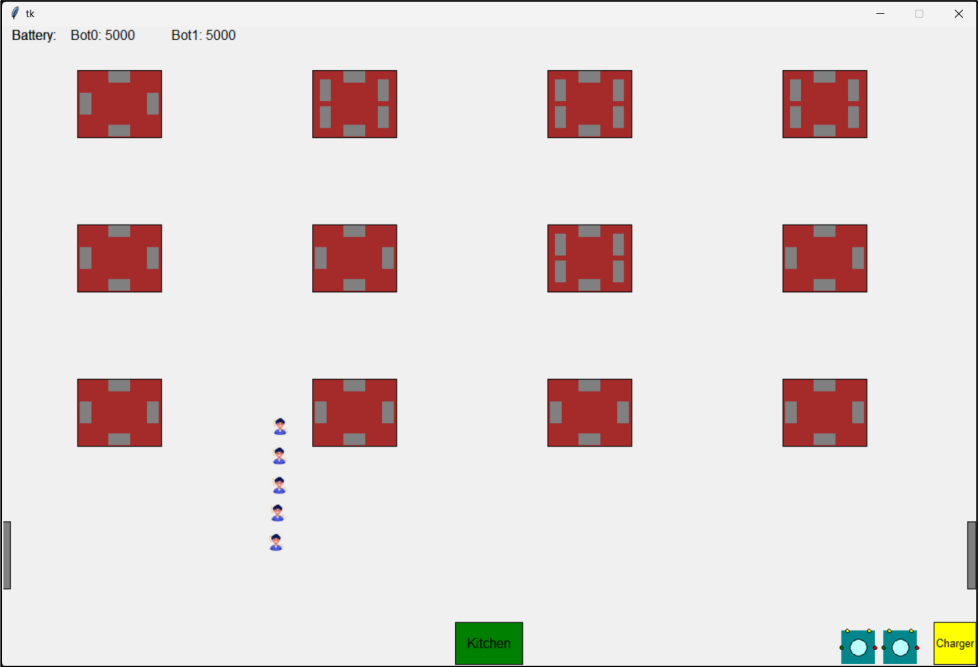
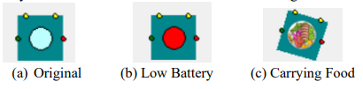
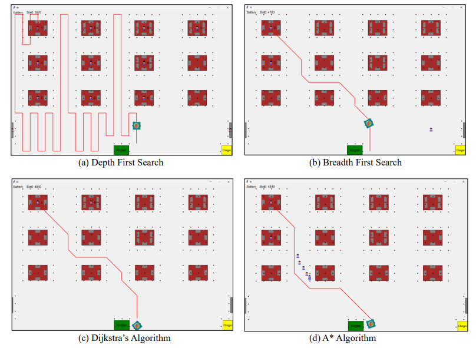
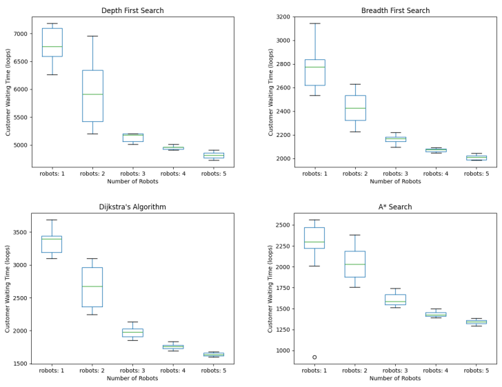
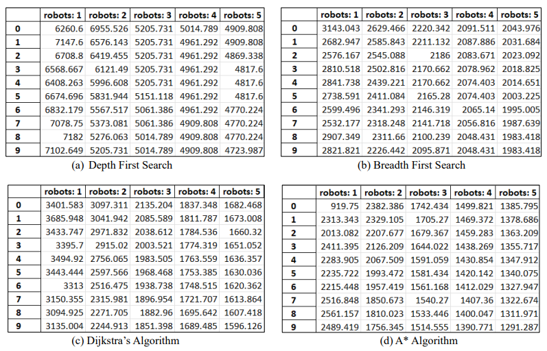

# 🍽️ Restaurant Bot Simulation: Optimizing Food Delivery with Pathfinding Algorithms

## 📌 Project Overview  
This project simulates a restaurant environment to analyze the impact of the number of autonomous delivery bots and different pathfinding algorithms on customer waiting times. The goal is to determine the optimal number of robots and the most efficient pathfinding algorithm for minimizing delivery time in a restaurant setting.  

## ❓ Research Question  
**How do the number of bots and the choice of pathfinding algorithm impact the average customer waiting time in a restaurant environment?**  

## 🔬 Technologies Used  
- 🐍 **Python** (Simulation & Algorithm Implementation)  
- 🖥 **Tkinter** (GUI for the Restaurant Layout)  
- 📊 **Matplotlib** (Data Visualization & Graphs)  
- 📑 **Excel** (Result Storage & Analysis)  

## 🏗 System Design  
The restaurant environment consists of passive objects (tables, kitchen, doors, charging station) and agents (customers, robots, and a manager).  

### 📌 Restaurant Layout  
  

- **🤖 Robots**: Deliver food from the kitchen to customer tables using different pathfinding algorithms.  
- **👥 Customers**: Arrive in groups, occupy tables, place orders, and leave after eating.  
- **👨‍💼 Manager**: Assigns food delivery tasks to available robots based on efficiency criteria.  

### 🏃‍♂️ Robot States  
  

## 🛤 Pathfinding Algorithms Implemented  
1. **🔍 Depth First Search (DFS)**: Explores paths exhaustively, often resulting in long and inefficient routes.  
2. **🌳 Breadth First Search (BFS)**: Finds the shortest path but can be computationally expensive.  
3. **📍 Dijkstra’s Algorithm**: Optimizes shortest path calculations based on cost but has more turns.  
4. **⭐ A* Algorithm**: Combines cost and heuristic measures for the most efficient pathfinding, making it the best-performing algorithm in this study.  

### 📍 Path Comparisons  
  

## 📊 Experiment Setup  
- The simulation runs for **300 seconds** per test.  
- **Number of Bots**: Varied from **1 to 5**.  
- **Pathfinding Algorithms**: Each algorithm was tested across different bot counts.  
- **Performance Metrics**: Average customer waiting times were recorded and analyzed using box plots.  

## 📈 Experiment Results  

### 📉 Effect of the Number of Robots on Waiting Time  
  

- **Increasing the number of robots reduces customer waiting time** but reaches a saturation point where additional bots provide diminishing returns.  

### 📉 Effect of Pathfinding Algorithm on Waiting Time  
  

- **A* Algorithm performed the best**, minimizing customer waiting times compared to other algorithms.  
- **Depth First Search was the least efficient**, leading to significantly longer delivery times.  

## 🏆 Key Findings  
✅ **Optimal number of robots = 3** (Adding more bots does not significantly improve waiting times).  
✅ **A* Algorithm is the most efficient** for minimizing customer waiting time.  
✅ **DFS is highly inefficient** and not suitable for real-time applications.  

## 📌 Future Work  
- Expanding robot functionalities to include **cleaning and customer guidance**.  
- Exploring additional **pathfinding algorithms** for further optimization.  
- Adapting the system for **real-world restaurant layouts** with dynamic obstacles.

  ## Presentation Link
  https://www.canva.com/design/DAGFHJKYZ_M/Qs39OW4gnlswmK5htBSp6g/edit?utm_content=DAGFHJKYZ_M&utm_campaign=designshare&utm_medium=link2&utm_source=sharebutton
